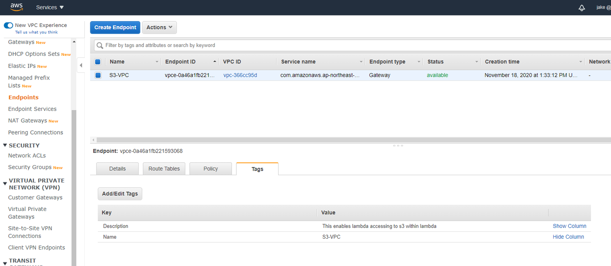

AWS Lambda에서 문서 Converting tool인 Libreoffice를 이용해 xlsx 파일을 pdf로 변환하는 기능을 구현하던 중 겪은 어려움과 주의사항을 기술합니다. 추후 본 기능을 고도화할 때 참고하면 도움될만한 내용을 담고 있습니다.

## 목표

Python은 엑셀의 비주얼 서식을 유지하며 PDF로 변환해주는 라이브러리를 찾지 못했기 때문에 LibreOffice를 이용해서 엑셀파일을 변환하고 이를 PDF로 변환하여 다운로드 가능하게 한다.

## 이슈

### 1.람다에서 Streaming으로 Response를 제공할 수 없음.

람다는 응답을 한번 보내면 종료됩니다. 일반적으로 웹에서 파일을 다운로드 받을 때는 Streaming으로 받는데 람다로는 그렇게 구현하는 방법을 찾지 못했습니다.

따라서 서버에서 컨버팅 작업을 모두 끝내고 파일로 생성되면 해당 파일의 Binary를 읽어들여서 이를 String으로 변환하고, 이 String을 Response의 Body에 담아 보냈습니다.

Client(웹)은 받은 String을 다시 Binary로 변환해서 이를 다운로드 하는 방식을 취했습니다. 너무 많은 파일을 한번에 변환하면 Timeout이 나기 때문에 최대 10개만 한번에 요청할 수 있도록 limit을 걸어두었습니다.

**Check point**

저는 실패했지만 API Gateway를 잘 만져주면 streaming방식의 response도 지원하는 것 같긴 했었습니다.

## 2. LibreOffice 설치문제

### 1) LibreOffice 바이너리를 람다에서 설치할 수 없다  

람다는 리눅스 패키지 설치가 안되거나 까다롭습니다. 예를들어 파이썬 Subprocess로 yum install PACKAGE 해도 안 됩니다. (== 커맨드라인으로 yum install PACKAGE 하는 것과 같음)

즉, LibreOffice 파이썬 Subprocess로 설치할 수 없고 설치할 수 있다 해도 정식버전의 용량이 2기가 이상이기 때문에 분명 설치하다가 뻗을 것 같았습니다.이리저리 찾아보던 중 인터넷의 누군가도 람다로 LibreOffice를 사용하려는 시도를 했었고 그 사람이 LibreOffice 바이너리 중 Essential 한 파일들만 추출해서 gz로 컴파일 한 버전을 올려둬서 (Thank god) 이를 사용했습니다. 하지만 다운받으라고 올려놓은 파일은 에러가 났고 그 사람이 올린 다른 포스팅을 뒤져보다가 거기 올려 둔 링크를 따라가니 제대로 된 걸 다운 받을 수 있었습니다.

### 2) LibreOffice 바이너리는 구했지만…

LibreOffice를 최대한 작게 압축한 파일의 용량이 100MB는 넘었습니다. s3 자유이용권이 있는게 아니면 어떤 방식이던 한 번 세팅하고 계속 재사용해야합니다. 이를 위해 AWS EFS를 사용했습니다. EFS는 AWS의 서비스에 붙어있는 이동식 디스크라고 생각하면 편합니다. 데이터는 영구적으로 저장되며 람다에서 /mnt/efs(폴더명은 변경가능) < 이런 식으로 접근해서 EFS에 저장 된 파일을 사용할 수 있어 여기에 LibreOffice.gz 파일을 저장하기로 했습니다.

**Check point**

람다의 Layer안에 libreOffice를 압축해제한 파일을 포함해서 배포해도 될듯 합니다. 다만 지금 람다들에 Layer를 잘 안 붙이고 있고 EFS가 프리티어기간엔 무료라길래 일단은 냅뒀습니다.

### 3) 람다에 EFS를 붙이자 람다에서 S3에 접근을 못함

EFS를 사용하려면 람다와 EFS가 같은 AWS VPC 안에 있어야 합니다. 따라서 Lambda를 우리 기본 VPC 안으로 옮겼더니 S3에 접근을 못하게 됐습니다.
이유를 간략히 설명하면 기본적으로 S3는 VPC 외부, 즉 AWS 서비스 영역에 있습니다. 람다도 원래는 S3와 같이 AWS 서비스 영역에 있는데 VPC 안으로 데리고 무작정 들어오니 VPC 외부인 AWS 서비스영역과 소통할 수 없게 된 것입니다. 따라서 VPC 안의 AWS 서비스가 S3에 접근할 수 있도록 해줘야 합니다. (이 내용은 제가 이해/추측한 내용을 바탕으로 쓴거라 틀릴 수도 있습니다. 틀린 부분이 보이면 Correct 해주세요)

Default 상태 (S3, 람다가 AWS 서비스 영역에 있는 경우)를 그림으로 보면 아래와 같습니다. (AWS, Function(람다), S3, VPC만 봐주세요.)

찾아보니 AWS VPC에 Endpoint를 만들어주면 된다고 해서 S3에 접근하는 Endpoint를 붙였더니 S3에 접근 가능해졌습니다.

### 4) LibreOffice.gz 파일을 압축해제 하기 전에 Timeout이 발생

LibreOffice.gz를 람다(EFS)에서 압축해제하는데 시간이 꽤 걸립니다. 람다의 limit duration을 5분으로 잡아놔도 29초만 되면 Timeout Response를 받았습니다. 검색해보니 이건 람다가 아니라 API Gateway에서 리턴하는 값이며 상수라서 현재 사용자가 변경 불가능하다고 합니다. 따라서 사용자가 웹에서 API GW를 통해 인터랙션할때에는 29초를 넘기지 않아야 합니다. 

하지만 API Gateway에서 Timeout Response를 보낸다고 해도 Lambda가 바로 종료 되는 것은 아닌 것 같습니다. 후에 로그를 보니 람다의 End Request duration이 2분정도인 기록을 봤기 때문입니다.

즉, Request는 API Gateway를 타면 29초에 무조건 Timeout Response를 보내지만 람다는 limit duration까지 살아서 제 역할을 하고 종료되는 듯 합니다.

### 5) LibreOffice로 변환하려고 하니 로컬에서는 잘 됐는데 람다에선 또 오류가 발생...

로컬에선 잘 동작하던 것이 람다에 올린 후 사용하니 /tmp/instdir/program/oosplash: error while loading shared libraries: libX11.so.6: cannot open shared object file: No such file or directory 이런 에러를 내뱉습니다.

에러 해결방법을 찾다보니 libX11.so를 깔아야겠다는 결론에 도달했는데 패키지 인스톨 방식 yum install PACKAGE 으로 설치해야 합니다. 그런데 위에 언급한대로 람다 안에서는 패키지 인스톨이 잘 안 됩니다. 별별 짓을 다 해봤지만 안 되다가….인터넷 어떤 글에서 Amazon Linux 2엔 Amazon Linux 1에 있는 일부 패키지가 없다는 글을 봤습니다.

혹시 지금 사용하는 람다도 그럴까 싶어서 람다 컨테이너에서 사용하는 이미지를 Amazon Linux 1로 바꿔봤더니… 됩니다. Amazon Linux 1,2를 고를 수 있는 것은 아니고 선택하는 Runtime의 Python버전에 따라 결정됩니다. (Python 3.8은 Amazon Linux2, 그 이하는 1입니다.) 이미지가 자동으로 사용됩니다. 따라서 해당 람다의 런타임 버전을 3.8에서 3.7로 변경했습니다.

### 6) LibreOffice 폰트 문제

람다에서 LibreOffice로 변환 시도까지 다 했으나 한글이 모두 깨져서 □ < 으로만 나왔습니다. 인코딩 이슈인 줄알고 여러 방법을 취해봤는데 운영체제에 Font가 없어서 발생한 문제였습니다.

람다에 Font를 설치해주려 했으나 이것도 여의치 않고 (람다는 기본적으로 /tmp, /var/task, /opt 이외의 디렉토리는 못 건드린다고 보면 될 것 같습니다.)

여러 방법을 시도해보다가 실행환경이 아닌 libreOffice 바이너리에 해당 Font를 넣어주라는 포스팅을 봤고 그렇게 시도해보니 정상적으로 출력 되었습니다.

**Reference**

똑같이 구현한 서비스 소개 포스팅  
[https://medium.com/hackernoon/how-to-run-libreoffice-in-aws-lambda-for-dirty-cheap-pdfs-at-scale-b2c6b3d069b4](https://medium.com/hackernoon/how-to-run-libreoffice-in-aws-lambda-for-dirty-cheap-pdfs-at-scale-b2c6b3d069b4)

해당 서비스 Demo  
[https://vladholubiev.com/serverless-libreoffice/](https://vladholubiev.com/serverless-libreoffice/)