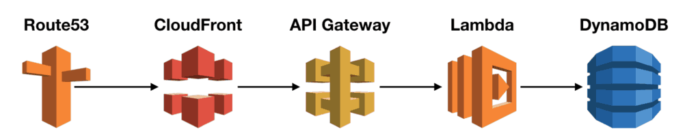

요번주는 DB쪽 작업이 많아서 주로 DB쪽이 많은 것 같다. 

## 1. Join을 여러번 하면 성능이 저하되는가?

### TL;DR
> Query Optimizer가 알아서 잘 조정해주지만 Join 순서가 좋지 않으면 optimize되지 않는 경우도 있으니 유의하자. 

Join은 DB 정규화가 잘 되어있는 경우에 중복되는 [칼럼 * ROW 수 * 자료형] 용량을 줄일 수 있다는 장점이 있다.  대규모 서비스를 지탱하는 기술에서도 봤듯 한 필드 * Row 수 = (자료형에 따른 데이터 크기 * Row수) 라서 정규화를 하면 전체 용량이 줄어든다는 뜻.

조인이 수행될 수 있는 경우의 수는 아래와 같은 두 가지 요소에 의해 다양하게 발생할 수 있다.

(1) 테이블의 조인 순서: 먼저 액세스되는 테이블과 뒤에 액세스되는 테이블\
(2) 조인 방식: Nested-Loop, Sort-Merge, Hash

조인의 경우의 수는 조인 순서가 영향을 미치므로 [(조인 대상 테이블)! * 조인방식(3)]이 된다. 그래서 각 조인 경우의 수 마다 성능이 다르다고 하는데 이전에 조인 방식에 대해 찾아보기로는 해쉬 조인 방식이 언제나 거의 낫다라는 것을 봤었다. 그래서 특별한 경우가 아니라면 아마 해시조인만이 사용될 듯 하다. 

Nested Loop 조인에서는 가장 먼저 수행되는 테이블의 처리범위 (즉 Outer Loop)가 전체 일량을 좌우한다고 한다. 따라서 가장 적은 처리 범위를 가진 테이블이 먼저 수행되도록 하면 최적의 조인을 구현할 수 있다. (=Row가 가장 적은 범위가 Outer Loop가 되는게 가장 낫다는 것)

지금 쓰고 있는 Maria DB는 무슨 join을 사용하는가 궁금해서 찾아봤는데 잘 나오지 않았다. 그리고 뒤에 나올 인덱스에 관한 정보를 찾다가 우연히도 발견했는데, MySQL은 버전 8.0.18부터 Hash Join이 생기고 그전까지는 모두 Nested-Loop Join만 쓴다고 한다. (그러니 MariaDB도 아마 자연적으로 NLP 방식만 사용했을것으로 추정된다.)

MySQL을 기준으로 찾아보니 기본값이 Block-Nested-Loop라고 한다. Postgres나 Oracle은 join하는 칼럼에 인덱스가 없다면 자동으로 머지소트 나 해시조인으로 가져온다 하는데 MySQL은 그렇게 되지 않는듯하다.

`select @@optimizer_switch;` 이걸 해도 block_nested_loop 옵션 같은 것은 없다. 그래서 default 방식좀 보려는데 안보인다...MySQL 태생이니 BNL방식 쓴다고 봐도 될지?

대부분 Query Optimizer가 잘 조정해주고 Join 순서만 유의하면 되니까 크게 신경은 안 써도 될텐데 Join 성능을 올리는 팁은 몇가지 있다.

먼저 Join 범위 자체를 줄이는 것이 도움이 된다. (WHERE절로 필터링이 아닐까 싶다. ) 처리해야하는 Row가 많을수록 JOIN이 더 느려진다.

그리고 [왓챠포스팅](https://medium.com/watcha/%EC%BF%BC%EB%A6%AC-%EC%B5%9C%EC%A0%81%ED%99%94-%EC%B2%AB%EA%B1%B8%EC%9D%8C-%EB%B3%B4%EB%8B%A4-%EB%B9%A0%EB%A5%B8-%EC%BF%BC%EB%A6%AC%EB%A5%BC-%EC%9C%84%ED%95%9C-7%EA%B0%80%EC%A7%80-%EC%B2%B4%ED%81%AC-%EB%A6%AC%EC%8A%A4%ED%8A%B8-bafec9d2c073)에서 본 JOIN 사용시 바로 써먹을 수 있는 팁은

(1) SELECT 시에는 꼭 필요한 칼럼만\
(2) 가져온 칼럼에 직접 연산을 하지 않고 범위를 지정하는게 낫다.\
```
Bad:  WHERE column_value > column_value - 10 AND column_value < value + 10
Good: WHERE column_value BETWEEN column_value - 10 AND column_value + 10
```
(3) 스트링 서치할 때는 '%를 가능한 앞에 배치하지 말 것\
(4) DISTINCT같은 중복 row 제거는 느려지게한다.\
(5) 3개 이상의 테이블을 INNER JOIN 할 때는, 크기가 가장 큰 테이블을 FROM 절에 배치하고, INNER JOIN 절에는 남은 테이블을 작은 순서대로 배치하는 것이 좋다고 한다.


레퍼런스
- [https://5dol.tistory.com/12](https://5dol.tistory.com/12)
- [https://jojoldu.tistory.com/520](https://jojoldu.tistory.com/520)


## 2. varchar 타입의 칼럼에 저장되는 데이터는 모두 고정된 용량을 차지할까?

### TL;DR

> prefix(1바이트 + 2바이트) + value의 용량으로 계산된다.

In contrast to CHAR, VARCHAR values are stored as a 1-byte or 2-byte length prefix plus data. The length prefix indicates the number of bytes in the value. A column uses one length byte if values require no more than 255 bytes, two length bytes if values may require more than 255 bytes.

Char와 달리, Varchar는 1바이트 혹은 2바이트의 prefix + 값의 data가 차지하는 용량이 된다. prefix는 저장되는 값의 byte를 나타내는 값인데 만약 값이 255바이트를 넘지 않으면 prefix로 1바이트를 쓰고 값이 255바이트를 넘는다면 칼럼 prefix는 2바이트를 쓰게 된다.
즉 동적으로 space가 결정된다. 그래서 보통 varchar(255)가 많았던걸까? prefix 1바이트 + 255바이트 로 총 256바이트가 되니까.

## 3. DB 인덱스의 장단점은 무엇인가?

얼마 전 Row가 10만정도 되는 테이블 하나와 몇천~몇만건 되는 테이블들을 몇개 JOIN했더니 너무 느려서 Timeout이 자꾸났다. 보니까 인덱스가 걸려있지 않아서 인덱스를 적용했더니 쿼리가 순식간에 돈다. 
실제로 인덱스가 걸린 행들을 사용하거나 그냥 걸어서 잘 몰랐는데 이번에 써보니까 확실히 유무여부가 천지차이였다. 기념으로 인덱스에 관해서 좀 찾아봤다. 보다보니 Pyton Dictionary가 자연스럽게 떠오른다.  대규모 서비스 기술에서 인덱스를 쓰면 속도가 최소 십만~백만배정도 (혹은 백만배 이상)이 차이난다고 한 것 같은데 실제로도 그런 느낌이라 좀 신기한 느낌이다.

그럼 인덱스의 단점은 뭐가 있을까? 도 궁금해져서 찾아봤다. insert, update의 속도가 저하된다는 것이다. 인덱스를 보관하는 인덱스 테이블을 insert, update를 해줘야 하기 때문에 만약 테이블에 insert와 update가 빈번히 일어난다면 성능에 부정적 영향을 줄 수도 있다.

## 4. AWS 서버리스 자원을 활용할 때 캐싱 사용 방식

Amplify가 잡다한 설정을 다 잘해주다보니 서버리스로 개발하면서도 캐시에 대해 별로 생각할 기회가 많지 않았는데 문득 갑자기 궁금해져서 찾아봤다. 

보통은 아래와 같은 구조로 되어있을 것이다. (내 경우엔 DDB가 아니라 RDS가 되겠다.)


람다는 concurrent로 돌아가고 500 per minute의 limit 있지만 (이거는 이번 AWS REINVENT 2020 내용을 좀 더 봐야한다. Amplify, Lambda가 꽤 많이 바뀐 것 같은데 이 때 변경사항이 같이 발표되었을 수도 있다.) limit을 넘는 스파이크가 튄다면 캐시의 역할이 크게 느껴질 수 있다.

[레퍼런스 포스팅](https://theburningmonk.com/2019/10/all-you-need-to-know-about-caching-for-serverless-applications/)에 따르면  일반적으로 캐싱을 할 때는 end-user에 가까운 곳에서 캐시를 둘수록 좋다고 한다.
그런 의미에서 Client Device부터 타겟으로 캐싱을 시작하고 캐싱과 관련 된 HTTP 헤더를 통해 적절하게 튠하거나 Refresh 해주면 될 것 같다. 

CloudFront는 GET, Head, Option만 캐싱이 된다하니 다른 메서드들도 캐싱이 필요하다면 API Gateway에 설정한다.

Lambda도 캐싱이 된다하는데 이건 좀 신기했다. 예제 코드를 보면

```jsx
let data; // this is reused between invocations
const loadData= async () => {
  if (!data) {
    // load data
    // 콜드 스타트에만 run되고 그 외에는 캐싱된다고 한다.
    // 이거는 람다의 특성인것인가?
  }
  return html
}
module.exports.handler = async (event) => {
  return {
    statusCode: 200,
    body: await loadData(),
    headers: {
      'content-type': 'text/html; charset=UTF-8'
    }
  }
}
```

AWS Document의 Best Practice에도 나와있다고 하니 이걸 더 봐야겠다. [https://docs.aws.amazon.com/lambda/latest/dg/best-practices.html](https://docs.aws.amazon.com/lambda/latest/dg/best-practices.html)

마지막으로 DDB에는 DAX라는 DynamoDB Accelerator라는 것이 있는데 이거까지는 갈 일이 있으려나 싶은 생각이 들어 Pass. 나중에 DDB 캐싱이 실제로 필요해질 때 보면 될 것 같다.

레퍼런스: [https://theburningmonk.com/2019/10/all-you-need-to-know-about-caching-for-serverless-applications/](https://theburningmonk.com/2019/10/all-you-need-to-know-about-caching-for-serverless-applications/)

## 5. Join은 실제로 어떻게 이루어지는가?

A SQL query with more tables requires multiple steps: first building an intermediate result set by joining two tables, then joining the result with the next table and so forth.

Join을 하면 Join 쿼리를 실행하면 해당 테이블을 Join한 intermediate result를 만들고 그 다음 테이블을 또 Join하고.. 이런식으로 연쇄작용이 발생한다고 한다. 보통은 SQL Optimizer가 알아서 잘 정리해준다지만 join order를 잘못짜면 optimzer가 잘 정리를 못해주는 경우도 있다 하므로 Order는 중요하다.

그리고 아래와 같은 정보를 찾았는데 bind parameter는 후에 좀 더 리서치 해볼 예정.
Not using bind parameters is like recompiling a program every time.
[https://use-the-index-luke.com/sql/join](https://use-the-index-luke.com/sql/join) The more complex the statement the more important using [bind parameters](https://use-the-index-luke.com/sql/where-clause/bind-parameters) becomes.


## 6. 조인방식 좀 더 자세히

조인의 방식에는 NL(Nested Loop), Hash, Sort-Merge방식이 있다. 이 때 어떤 방식을 쓸 지와 어떤 테이블을 드라이빙 테이블(JOIN의 주 테이블이라고 일단 생각하면 된다.)로 할 지는 단순히 선정되지 않고 인덱스 유무여부등을 따진 후에 DBMS에서 자체적으로 선정한다.

### Nested Loop

N+1 문제로 운을 띄우고 [https://use-the-index-luke.com/sql/join/nested-loops-join-n1-problem](https://use-the-index-luke.com/sql/join/nested-loops-join-n1-problem) 

왜 N+1이냐? 드라이빙 쿼리가 N개의 result를 반환하니까.
Nested Loop 방식은 outer loop가 적은 수의 row를 반환하면 좋은 성능을 낼 수 있다고 한다. Otherwise, optimizer가 NL이 아닌 다른 알고리즘을 선택한다. 

### hash join

hash join은 순서가 중요하진 않지만 hash table을 메모리에 올려놓을 것이고 이 사이즈를 줄이는 게 중요하기 때문에 planning할 때 이걸 염두에 두어 hash table 사이즈를 작게 만드는 것에 초점을 두고 쿼리를 플래닝한다. where절 같은 것으로 조건을 두면 해당하는 row가 줄어들테니 도움이 된다. *로 모든 칼럼을 가져오는 것이 아니라 필요한 칼럼들만 선택해서 가져오는 것도 해시 테이블의 메모리를 줄일 수 있으니 메모리 절감에 도움이 된다. 언제나 필요한 칼럼들만 가져오는 것은 좋은 practice가 될 것 같다. MySQL은 해시조인을 2019년 버전 8.0.18에서 introduce했다고 한다. 이전에는 NLP만 사용했다 ㄷㄷ 어제 종일 MySQL의 기본 Join방식은 어케 되는건가 찾아봤는데 하나빡에 없어서 그렇게 안나왔나보다..

### 머지소트 조인

머지소트의 특징은 Join order의 순서가 중요하지 않다는 것(장점인진 모르겠지만?)인데 row가 이미 정렬이 되어있을 때 그 효과가 크다고 한다. 정렬이 이미 된 경우에 사용하는 알고리즘이라 인덱스도 사용하지 않는듯 한데 이건 좀 더 찾아봐야 할 듯 하다. MySQL은 머지소트 조인을 아예 지원하지 않는다고 한다.

[https://use-the-index-luke.com/sql/join/sort-merge-join](https://use-the-index-luke.com/sql/join/sort-merge-join)


## 7. 파이썬의 dict는 왜 빠른가?

dict를 사용하면 내부적으로 hash table을 만들어놓고 get하거나 조회할 때 만들어놓은 hash table을 index처럼 사용해서 빠르다.
hashmap을 내부적으로 만들고 사용하니 메모리 사용량이 너무 많아지지 않을까 하는 궁금증이 생겨서 찾아봤다. `TL;DR - From Python 3.6, dictionaries don’t even use that much memory.` 이 전까지는 그런 trade-off가 있던 것 같은데 3.6부터는 내부적인 구현이 바뀌어서 그렇다. 

dict의 hash값을 hastable에 저장할 때는 파이썬 내장 함수인 hash 함수의 결과가 hash값이 되는데 특이한 점은 integer는 숫자 그대로를 hash값으로 쓴다. hash 값 충돌을 막기위해 보통은 이렇게 안한다고 하는게 python은 이것 resolve를 꽤 잘하나보다.

3.6버전 이전에는 dict의 해시값 충돌을 막기위해 일부러 해시테이블에 공란을 섞어놨다. 일정 사이즈가 넘어가면 파이썬에서 dict전체를 더 큰 공간으로 옮겼고 (마치 array 자료형에 item 추가할 때 그렇듯) 그래서 dict에 insert를 하는 경우 insertion 순서를 보장할 수 없던 것이다. (추가로 인해 threshold가 넘어가면 다른 메모리공간에 다시 다 할당될테니)

3.6부터는 이런 방식을 개선해서 기존에 하나로만 관리되던 해시테이블의 역할을 분리하여 1개의 index 테이블과 다른 {하나의 해시값: value}를 가진 테이블 총 2개로 만들어 기존의 behavior를 변경했다고 한다. 자세한 내용은 reference에.

그래서 결론적으로 3.6부터는 insertion order도 보장되고 메모리도 효율적으로 관리하는 방식이 된 것이다. 

아래 링크들을 보면 잘 나와있다.

[https://www.jessicayung.com/python-lists-vs-dictionaries-the-space-time-tradeoff/](https://www.jessicayung.com/python-lists-vs-dictionaries-the-space-time-tradeoff/)

[https://stackoverflow.com/questions/39980323/are-dictionaries-ordered-in-python-3-6](https://stackoverflow.com/questions/39980323/are-dictionaries-ordered-in-python-3-6)


## 8. MySQL의 SET SESSION transaction isolation level {OPTION} 에 관해

트랜잭션이 여러개일 때 경쟁조건이 생기는 경우 MySQL에서 각 트랜잭션의 behavior를 어떻게 다룰지 선언하는 부분이다. OPTION에 들어갈 수 있는 항목중 4개를 살펴보면

1. READ UNCOMMITTED

다른 트랜잭션에서 stage 중인 결과 (=dirty한 결과)도 같이 가져온다.
그래서 이름이 READ UNCOMMITTED. 따라서 B 트랜잭션에서 UPDATE 쿼리를 실행하고 아직 Commit을 안했더라도 A 트랜잭션에서 조회를 하면 B트랜잭션에서 UPDATE한 결과를 볼 수 있다.

= B트랜잭션이 성공적으로 Commit되지 않았을 경우 안정적이지 않다.

2. READ COMMITTED

다른 트랜잭션에서 커밋한 결과만을 가져온다. B 트랜잭션에서 UPDATE 쿼리를 실행했어도 Commit을 안했다면 A 트랜잭션에서 B트랜잭션이 끝나기 전에 조회하더라도 UPDATE한 결과를 볼 수 없다.

= 안정성은 높으나 동시성 부분이 조금 약하다고 볼 수 있다.

3. REPEATABLE READ

READ COMMITTED와 비슷하지만 조회를 할 때마다 가장 최신화 된 데이터를 가져온다. 단, 이것은 외부 트랜잭션의 영향을 받는 것이 아니고 하나의 트랜잭션에서만 해당한다. 즉, A트랜잭션 안에서 SELECT, UPDATE(COMMIT), SELECT를 한다면 마지막 SELECT에선 이 전엔 UPDATE까지 한 결과를 가져오지만 A트랜잭션 중에 B트랜잭션에서 UPDATE, COMMIT을 했더라도 그 row는 조회되지 않는다.
이게 가능한 이유는 SELECT를 할 때 현재 테이블의 스냅샷을 가져오기 때문이다. 그리고 그 스냅샷의 결과는 새로 SELECT를 하기 전까지 쓰이게 된다. 조회시점에 현재 트랜잭션에서 가장 최신화 된 데이터를 가져오는 방식이다.

= 안정적이고 성능도 나쁘지 않은 적절한 평균의 느낌이다. 그래서 기본값으로 설정되어있다.

4. SERIALIZABLE

SERIALIZABLE은 사실 왜 이름이 이렇게 되었는지 잘 모르겠는데 경쟁조건을 피하기 위해 다른 트랜잭션은 현재 접근중인 자원에 접근할 수 없도록 배제를 시켜버린다. 즉 A트랜잭션이 진행 중일때 B트랜잭션에서 UPDATE를 하려고 하면 B트랜잭션은 waiting 상태가 된다. 제어권은 A트랜잭션이 끝나야 넘어오게 된다. 

= 가장 안정적인 방법일테지만, 그만큼 희생도 따를듯 하다.